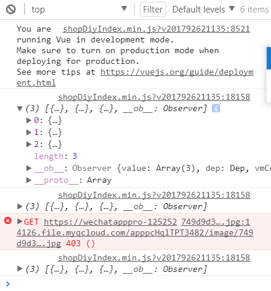
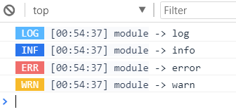

# Logger

一个用来在控制台打印log的工具，让log看起来更美观，为log指定模块。

通常我们在console里面看到的log都是如下图所示，完全不明意义的log，不知道log来自哪个模块。



使用Logger库之后的log，如下图所示：


#### 使用方法：

```javascript
var logger = new Logger('module'); //实例化一个logger对象，传入一个参数表示当前log所处的模块

//logger实例方法一共4个方法，对应不同log的等级
logger.log('log');
logger.info('info');
logger.error('error');
logger.warn('warn');
```



```javascript
//Logger提供两个方法，setConfig、getConfig
Logger.getConfig('version');//获取版本号

Logger.setConfig('action', [
    'time', 'level', 'module'
]); //指定打印log时，显示哪些部分，时间、等级与模块名

//可配置项如下
{
    "switch": true, //是否打印日志
    "level": 0,  //日志显示等级
    "action": ['time', 'level', 'module'],  //打印日志显示的模块
}

//日志等级对应如下
{
    'LOG': 0,
    'INFO': 1,
    'WARN': 2,
    'ERROR': 3
}

Logger.setConfig('level', 2); //只打印WARN级别以上的日志，等级不够的日志进行忽略

Logger.setConfig('switch', false); //全局开关，上线之前只要把开关置为false，所有log都会关闭，不必上线前还在全局慢慢删除log
```
